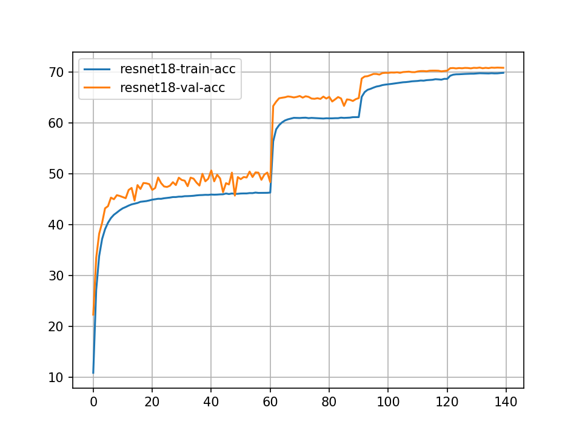
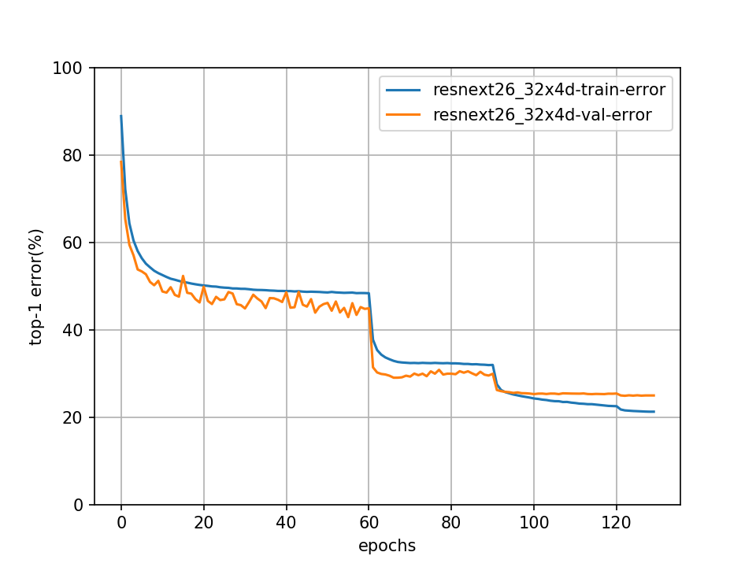

# bupt-priv pytorch-classification
Classification on CIFAR-10/100 and ImageNet with PyTorch.


## Disclaimer
The official pytorch-classification code is available [here](https://github.com/bearpaw/pytorch-classification), thanks for bearpaw's job!

The bupt-priv pytorch-classification is modified version of [pytorch-classification](https://github.com/bearpaw/pytorch-classification), and not for commercial use.


## Features
* Unified interface for different network architectures
* Multi-GPU support
* Training progress bar with rich info
* Training log and training curve visualization code (see `./utils/logger.py`)
* **Add Aligned Inception Resnet/ResNeXt (by soeaver)**
* **Add ResNeXt26-32x4d (by soeaver)**


## Install
* Install [PyTorch](http://pytorch.org/)
* Clone recursively
  ```
  git clone --recursive https://github.com/soeaver/pytorch-classification
  ```


## Training
Please see the [Training recipes](TRAINING.md) for how to train the models.


## Results

### CIFAR
Top1 error rate on the CIFAR-10/100 benchmarks can be found in official [pytorch-classification](https://github.com/bearpaw/pytorch-classification)

### ImageNet
Single-crop (224x224) validation error rate is reported. 

| Model                       | Params (M)         |  Top-1 Error (%)   | Top-5 Error  (%)   |
| --------------------------- | ------------------ | ------------------ | ------------------ |
| ResNet18                    | 11.69              |  30.09             | 10.78              |
| ResNeXt50-32x4d             | 25.03              |  22.6              | 6.29               |
| ResNet18 (bupt-priv)        | 11.69              |  29.11             | 10.07              |
| ResNeXt26-32x4d (bupt-priv) | 15.39              |  24.93             | 7.75               |
| Aligned-Inception-ResNet101 (bupt-priv) | 64.38           |  20.74             | 5.56               |
| Aligned-Inception-ResNeXt50 (bupt-priv) | 28.09           |  --                | --                 |

- All the bupt-priv models are trained for 130/140 epochs, the lr schedule is 61 91 121.

<div align='center'>
  
  
</div> 

## Supported Architectures

### CIFAR-10 / CIFAR-100
Since the size of images in CIFAR dataset is `32x32`, popular network structures for ImageNet need some modifications to adapt this input size. The modified models is in the package `models.cifar`:
- [x] [AlexNet](https://arxiv.org/abs/1404.5997)
- [x] [VGG](https://arxiv.org/abs/1409.1556) (Imported from [pytorch-cifar](https://github.com/kuangliu/pytorch-cifar))
- [x] [ResNet](https://arxiv.org/abs/1512.03385)
- [x] [Pre-act-ResNet](https://arxiv.org/abs/1603.05027)
- [x] [ResNeXt](https://arxiv.org/abs/1611.05431) (Imported from [ResNeXt.pytorch](https://github.com/prlz77/ResNeXt.pytorch))
- [x] [Wide Residual Networks](http://arxiv.org/abs/1605.07146) (Imported from [WideResNet-pytorch](https://github.com/xternalz/WideResNet-pytorch))
- [x] [DenseNet](https://arxiv.org/abs/1608.06993)

### ImageNet
- [x] All models in `torchvision.models` (alexnet, vgg, resnet, densenet, inception_v3, squeezenet)
- [x] [ResNeXt](https://arxiv.org/abs/1611.05431)
- [x] [Aligned Inception Resnet/ResNeXt](https://arxiv.org/pdf/1703.06211.pdf)


## Contribute
Feel free to create a pull request if you find any bugs or you want to contribute (e.g., more datasets and more network structures).
